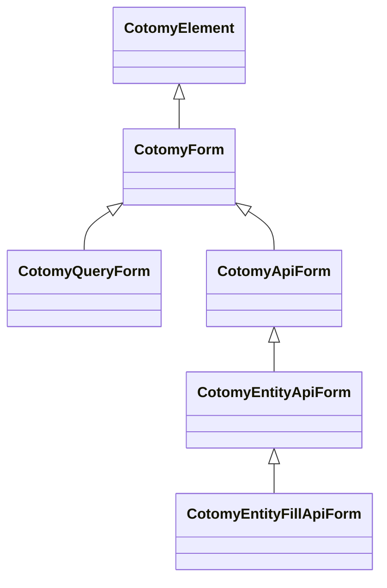

# Forms Basics

Use a native HTML form for ordinary GET or POST navigation. If Cotomy does not
need to control submission, `<form method="get">` and `<form method="post">`
should submit through the browser without a CotomyForm instance.

CotomyForm is the abstract base for Cotomy-managed forms. Initializing one
means that Cotomy intercepts the submit event, prevents the browser's default
submission, and delegates the operation to submitAsync().

## Form Types at a Glance

| Form Type | Base | Purpose | Notes |
| --- | --- | --- | --- |
| Native HTML form | — | Browser GET or POST | Use when standard submission and page navigation are sufficient |
| CotomyForm | CotomyElement | Cotomy-managed submit lifecycle | Abstract base for custom submitAsync() implementations |
| CotomyQueryForm | CotomyForm | Cotomy-managed query navigation via GET | Builds a query string from inputs and navigates |
| CotomyApiForm | CotomyForm | API submit with FormData | Handles FormData and API error events |
| CotomyEntityApiForm | CotomyApiForm | Entity-aware API submit | Switches POST to PUT when an entity key exists |
| CotomyEntityFillApiForm | CotomyEntityApiForm | Load and fill inputs | Fetches data and fills inputs when an entity key is present |

:::important Multiple select is excluded from automatic fill

CotomyEntityFillApiForm does not automatically synchronize
select elements with the multiple attribute.

If array-based synchronization is required,
handle it explicitly at application level.
:::

## Goals

- Choose between native HTML submission and Cotomy-managed submission
- Understand Cotomy's submit lifecycle
- See how form elements remain DOM-based

## Related Classes



## Steps

### 1) Use native HTML for ordinary navigation

```html
<form action="/profiles" method="get">
	<input name="name" />
	<button type="submit">Search</button>
</form>

<form action="/profile" method="post">
	<input name="name" />
	<button type="submit">Save</button>
</form>
```

These forms need no Cotomy initialization. The browser submits them and
performs the resulting page navigation.

### 2) Extend CotomyForm only for custom submit control

```ts
import { CotomyElement, CotomyForm } from "cotomy";

class SimpleForm extends CotomyForm {
	public async submitAsync(): Promise<void> {
		console.log("Form submitted");
	}
}

const form = new SimpleForm(`
	<form>
		<input name="name" />
		<button type="submit">Send</button>
	</form>
`);

form.appendTo(new CotomyElement(document.body));
```

The root element must be a &lt;form&gt; element. CotomyForm does not create one
for you.

### 2a) Bind existing HTML

Cotomy usually works with static or server-rendered HTML, then binds behavior
to the existing form using byId().

```html
<form id="profile-form">
	<input name="name" />
	<button type="submit">Save</button>
</form>
```

```ts
import { CotomyForm } from "cotomy";

class ProfileForm extends CotomyForm {
	public async submitAsync(): Promise<void> {
		console.log("Profile submitted");
	}
}

const form = CotomyForm.byId<ProfileForm>("profile-form", ProfileForm);
form?.initialize();
```

### 3) Initialize the form

```ts
form.initialize();
```

initialize() sets up Cotomy's internal submit handling. Call it only when the
form is intended to be Cotomy-managed.

### 4) Understand the submit flow

When the form is submitted:

1. Default browser submit is prevented
2. Cotomy calls submitAsync()
3. You control what happens next

### 5) Access form values

```ts
const nameInput = form.first(`input[name="name"]`);
console.log(nameInput?.value);
```

The state still lives in the DOM.

## Important Concept: Forms are Still DOM

Cotomy does not create a separate form model. Inputs, values, and validation
remain tied to the DOM. CotomyForm controls the submission lifecycle for forms
that opt into Cotomy management.
Form submission logic is centralized, while field state remains on each input element.

### CotomyForm does not:

- Add a global form state store
- Auto-bind inputs to JS objects
- Provide native browser submission after initialization

## What just happened?

You:

1. Kept ordinary GET and POST forms native
2. Created a CotomyForm subclass for custom submission
3. Registered Cotomy's submit lifecycle
4. Handled the Cotomy-managed submission in code

This pattern scales to API and entity forms.

## Next

Next: [API Client Basics](./05-api-integration.md).
